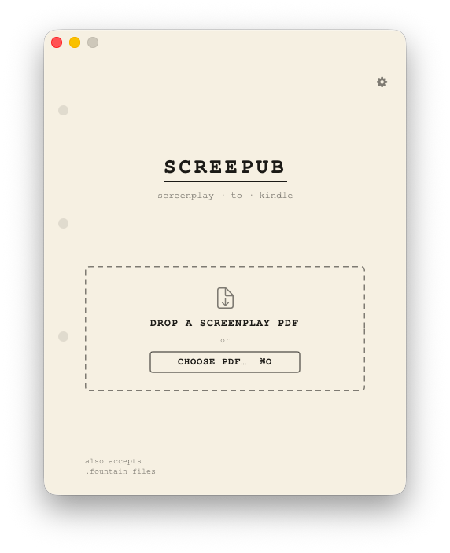
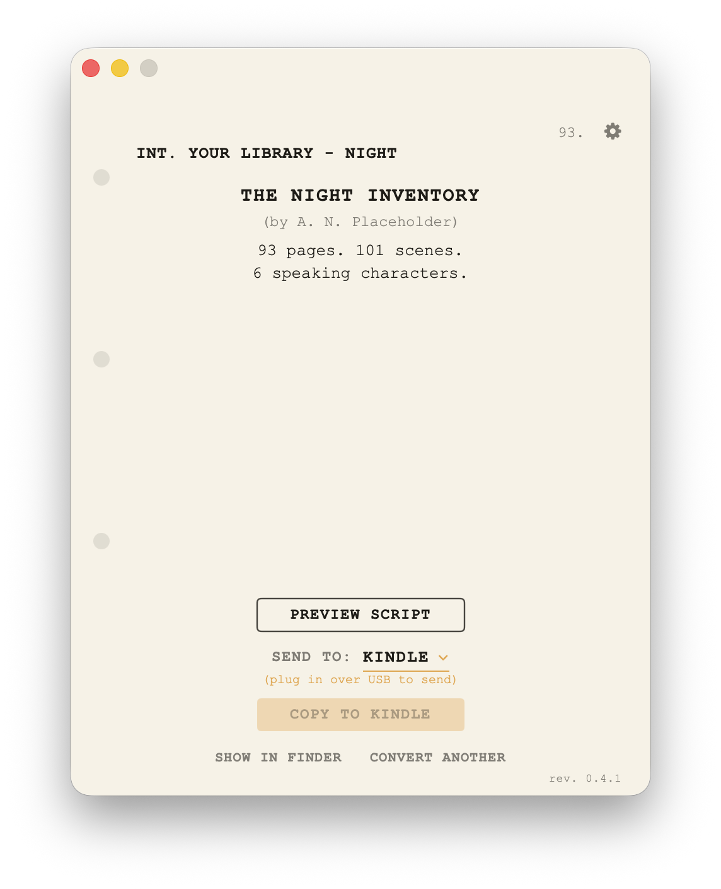
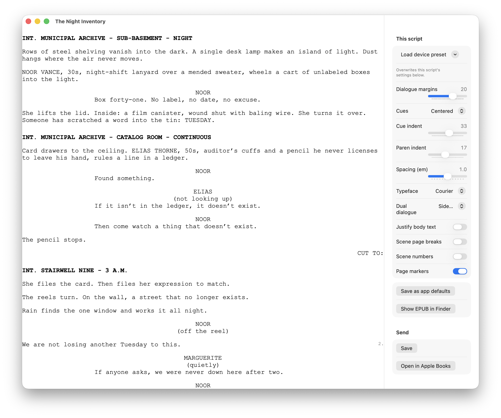

# Screepub

[](https://github.com/ssandweiss/screepub/releases/latest)
[](LICENSE)


**Read screenplays on your Kindle the way they're meant to be read.**

<p align="center">
  <a href="https://github.com/ssandweiss/screepub/releases/latest/download/Screepub-macOS.dmg">
    <strong>⬇️ Download Screepub for macOS</strong>
  </a>
</p>

<p align="center">
  
  
</p>

You get scripts as PDFs. You'd love to read them on a Kindle — on the couch, on a plane, anywhere that isn't a laptop. But drop a screenplay into any ordinary PDF-to-ebook converter and it falls apart: dialogue collapses into paragraphs, character names drift away from their lines, and the whole thing becomes a wall of text you have to pinch and squint at.

Screepub reads the script the way a person does. It looks at how the scenes, cues, and dialogue actually sit on the page, then rebuilds a proper e-book from that structure. Scenes stay scenes. Speeches stay readable. And because the result reflows, it looks right at *any* text size — so you can crank the font up on e-ink and the script still holds its shape.

## What it does for you

- **Drop a PDF, get a clean e-book.** Drag a screenplay onto the window and Screepub converts it — no settings to wrestle with first.
- **Send it straight to your reader.** Plug in your Kindle and it copies over, ready to open. No fiddling with file formats — Screepub picks the right one.
- **Or send it yourself.** Save a copy to your Desktop, or drag the file straight out of the window into a new message, and email it to your Kindle from whatever mail app you use.
- **Look before you send.** A built-in reader shows exactly how the script will read on the device, with formatting controls — margins, spacing, optional page numbers — that update live as you adjust them.
- **Built for real scripts.** Dual dialogue, revision marks, watermarks, page-break interruptions, offbeat character cues — the messy stuff in production drafts. Screepub sorts it out instead of choking on it.
- **Free and open source.** No account, no subscription, no catch.



*The reader, with the formatting rail open. Everything on the right updates
the page on the left as you drag it, and what you see is what the e-reader
gets.*

## Which readers?

Screepub was built for the **Kindle**, and that's the device it's actually
been tested on — sideloaded over USB, or sent to your `@kindle.com`
address. If you read scripts on a Kindle, you're on the well-worn path.

It also supports **Kobo** and **tolino** (the app spots them and copies
over the right format), plus a docked **reMarkable** (which gets the
original PDF — its own pagination and pen annotation suit scripts better
than a reflow).

Here's the honest state of it:

| Device | How it's sent | Status |
| --- | --- | --- |
| Kindle (USB mass storage) | AZW3 over USB, or the engine's MOBI | ✅ Verified on hardware, firmware 5.19.2 |
| Kindle (email) | EPUB to your `@kindle.com` address | ✅ Verified — and the better-looking route |
| Kobo | EPUB (or KEPUB) over USB | ⚠️ Built and code-tested, never run on a real device |
| tolino | EPUB into the device's `Books` folder | ⚠️ Built and code-tested, never run on a real device |
| reMarkable | Original PDF over its USB web interface | ⚠️ Built and code-tested, never run on a real device |
| Kindle (2024+, MTP) | — | ❌ Not supported; these no longer mount as USB drives |

The ⚠️ rows are not a hedge — they mean nobody has plugged one in. The code
paths are written and checked, but device firmware is where e-book
formatting goes to die, and I only own a Kindle. **If you own one of these,
a five-minute report either way is the single most useful thing you can send
me** — it works, or here's the screenshot of how it broke:
[open an issue](https://github.com/ssandweiss/screepub/issues/new/choose).

## What Screepub isn't

- **Not a screenwriting app.** It doesn't write, edit, or format scripts.
  It's for *reading* ones that already exist.
- **Not a coverage or analysis tool.** No summaries, no notes, no AI
  anything.
- **Not a PDF viewer.** It converts a screenplay into an e-book you read
  somewhere else, on a device built for reading.

## Install

1. **Download** the `.dmg` (button above).
2. **Open it** and drag **Screepub** into your Applications folder.
3. **Double-click** Screepub. It's notarized by Apple, so it just opens —
   no security warnings to click through.

Then drop a screenplay PDF on the window. It converts, and sends straight
to a connected e-reader.

**Requirements:** macOS 14 (Sonoma) or later, Apple Silicon or Intel.
[Calibre](https://calibre-ebook.com) is optional — only needed for the
AZW3 Kindle-sideload format.

## Your script stays on your machine

Scripts are confidential. Screepub is built accordingly.

- **No AI, no machine learning.** The conversion is ordinary code — it
  measures where text sits on the page and applies screenplay layout
  rules. There is no model involved, local or remote. The engine's entire
  dependency list is three libraries: a Fountain parser, a zip library,
  and Mozilla's PDF renderer.
- **Nothing is uploaded.** The conversion engine makes no network requests
  of any kind. Your PDF is read from disk and the e-book is written back
  to disk, on your computer.
- **No training data, ever.** Your scripts are not collected, stored,
  transmitted, or used to train anything — by us or anyone else. There is
  no server to send them to.
- **No accounts, no telemetry, no analytics.** Screepub does not track
  usage, report crashes, or phone home. It works fully offline.

The app touches the network in exactly three places, all of which need
your click: uploading to a **docked reMarkable** over its USB connection
(your own hardware, not the internet), opening **Amazon's Send-to-Kindle
page** in your browser, and opening **GitHub** if you report a bug.

The one thing worth being clear about: **you** can choose to send a script
somewhere — to your Kindle, over USB, or by email. If you email it to your
`@kindle.com` address, Amazon receives it and their terms apply, not ours.
That's your call to make, and Screepub never makes it for you.

Don't take our word for any of this — the [source is right here](src/),
and the licence guarantees it stays inspectable.

## Emailing scripts to your Kindle

Amazon lets you email documents to your Kindle and they show up wirelessly
— which is the *better* way to read a Screepub book, because Amazon
re-typesets what you send and the formatting comes out cleaner than a
plugged-in transfer.

It needs a one-time setup on Amazon's side, and it's genuinely confusing
the first time, so here it is in full. **Both steps are required** — most
people do the first, skip the second, and then their scripts silently
never arrive.

Everything below happens at Amazon → **Manage Your Content and Devices** →
**Preferences** → **Personal Document Settings**
([direct link](https://www.amazon.com/hz/mycd/digital-console/alldevices)).

**1. Find your Kindle's own email address.**
Under *Send-to-Kindle E-Mail Settings*, each device has an address like
`yourname_a1b2c3@kindle.com`. That's where you'll send scripts. You can
edit the part before the `@` to something memorable. Paste it into
Screepub's Settings (⌘,) and the app will offer to copy it for you on
every conversion.

**2. Approve the address you send *from*. ← the step everyone misses**
Under *Approved Personal Document E-Mail List*, click **Add a new approved
e-mail address** and add your own everyday email — the one you'll be
sending from. Amazon **silently discards** documents from any address not
on this list: no bounce, no error, no message. If your scripts never turn
up, this is almost always why.

**Then just send it.** Attach the EPUB to a normal email addressed to your
`@kindle.com` address and hit send. Subject and body don't matter. It
lands on every Kindle on the account, usually within a minute or two.

> Send the **EPUB**, not the MOBI or AZW3 — Amazon stopped accepting those
> for email delivery in 2022. Screepub's **Save a Copy…** defaults to EPUB
> and labels each format by what it's for, so you don't have to keep track.

---

## For developers

Everything above is all most people need. The rest of this README is the
technical side — the command-line tool, how to build the app, and how it
works under the hood. Screepub is a three-stage pipeline (PDF → Fountain →
EPUB3/MOBI) with a small Mac app on top; the `.fountain` intermediate is
kept as a durable, editable artifact. All formatting behaviors are options
(`src/options.ts`), exposed in the app's Formatting settings and on the CLI
via `--options file.json`; the registry with rationale for each lives in
`docs/formatting-options-log.md`.

## CLI

```bash
bun src/cli.ts <input.pdf | input.fountain> [options]
```

| Option | Effect |
| --- | --- |
| `-o, --output <file>` | EPUB path (default `<input>.epub`; companions follow it) |
| `--mobi` | also write a MOBI 6 (dependency-free USB sideload) |
| `--fountain <file>` / `--no-fountain` | intermediate `.fountain` control |
| `--options <file.json>` | formatting knobs (see the registry) |
| `--title` / `--author` | override detected metadata |
| `--force` | convert even if it doesn't look like a screenplay |
| `--json` | machine-readable result (the app↔engine contract) |
| `--debug` | dump classified elements JSON |

## Development

```bash
bun test                    # engine suite
bunx tsc --noEmit           # typecheck
app/build-app.sh            # build the Mac app
(cd app && swift run -c release kit-check)   # Swift-side checks
epubcheck out.epub          # validate
```

Integration tests run against small invented screenplays in
`tests/fixtures/`, committed and regenerated by `tools/make-fixture.py`. A
root-level `fixtures/` directory is gitignored for testing against real
scripts locally; tests that need it self-skip when it's absent. Docs worth
reading before changing layout code: `docs/screenplay-format-reference.md`
(print geometry + what Kindle's renderer actually honors) and `docs/adr/`
(stack decisions). [`CONTRIBUTING.md`](CONTRIBUTING.md) has the rest.

## Architecture

```
src/
  parser/     PDF → classified elements (geometry-driven: elements are
              classified by where they sit on the page, never by regex)
  fountain/   elements → Fountain (title block, CONT'D normalization,
              dual-dialogue-safe, styled-text pass-through)
  epub/       fountain-js tokens → EPUB3 (jszip, options-driven CSS)
  mobi/       tokens → MOBI 6 (hand-built PalmDB container)
  options.ts  FormatOptions — the single knob surface
  convert.ts  orchestration + guards
  cli.ts      CLI + --json contract
app/
  Sources/ScreepubKit/   engine bridge, transfer routes (USB/email/web)
  Sources/ScreepubApp/   script-page UI + settings with live preview
```

## License

Screepub is licensed under the **GNU Affero General Public License v3.0 or
later** (AGPL-3.0-or-later) — see [`LICENSE`](LICENSE). You're free to use,
study, modify, and share it; but if you distribute it, or run a modified
version as a network service, the corresponding source must be made
available under the same license.

The bundled engine embeds three libraries — see
[`THIRD-PARTY-NOTICES.md`](THIRD-PARTY-NOTICES.md), which also ships inside
the app.

Copyright © 2026 Darkwell Entertainment LLC.
