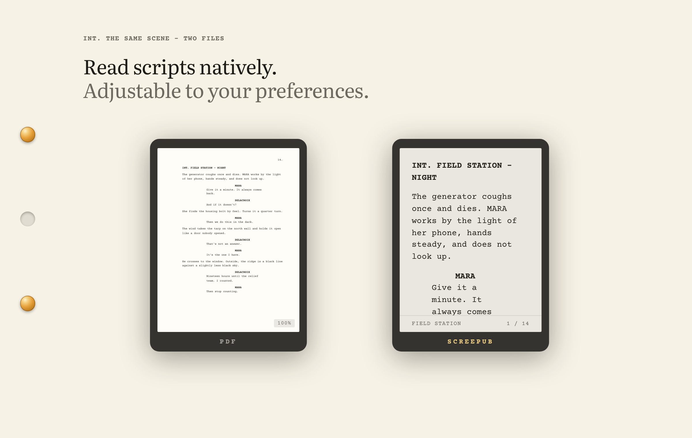
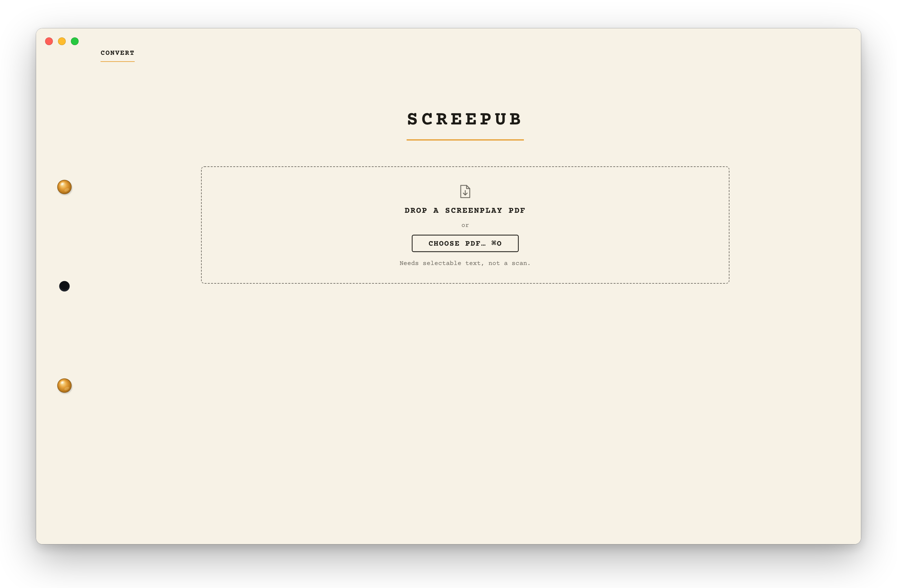
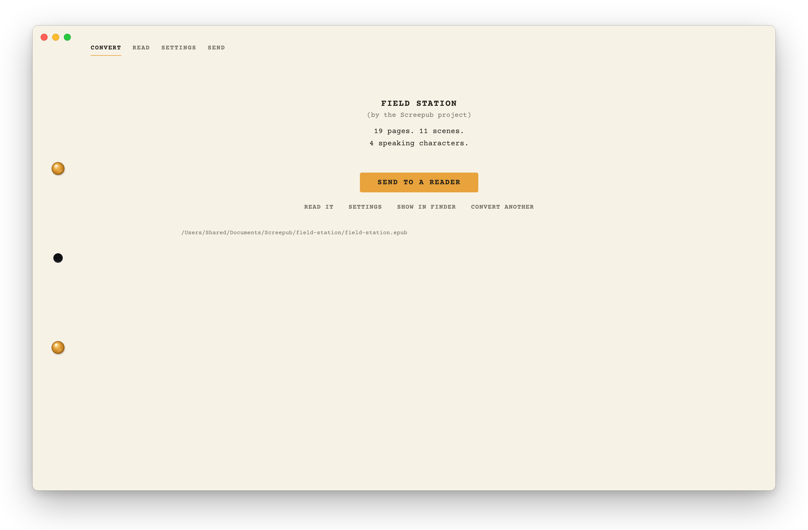
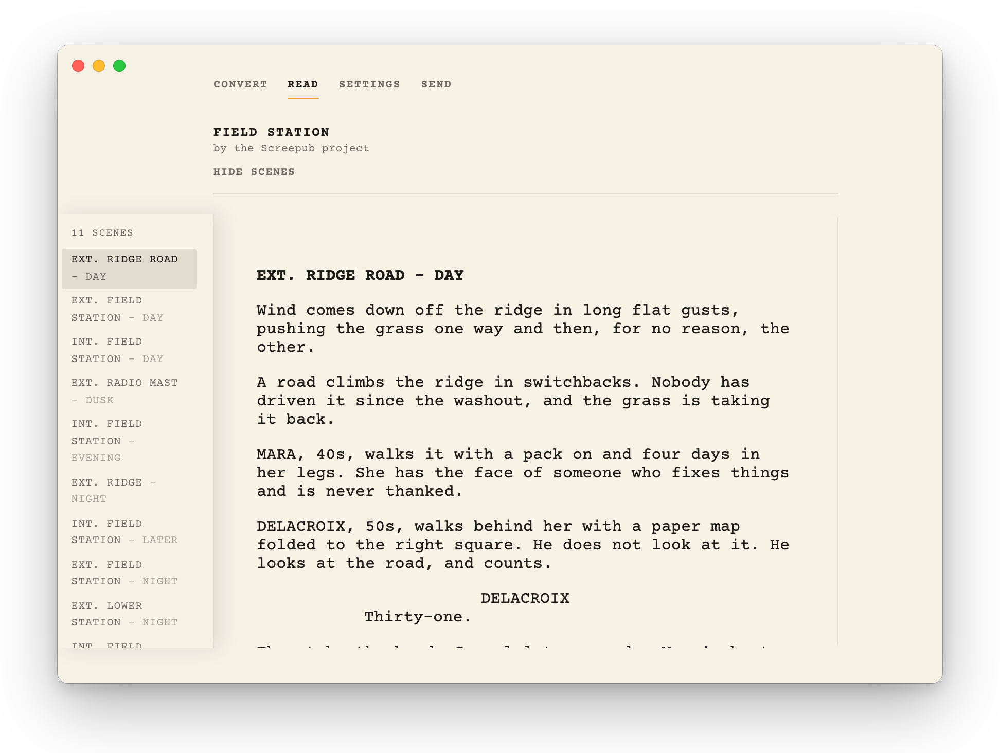

# Screepub

**Read screenplays on your e-reader the way they're meant to be read.**

  <a href="https://github.com/ssandweiss/screepub/releases/latest/download/Screepub-macOS.dmg"><strong>Download for Mac</strong></a>
  &nbsp;·&nbsp;
  <a href="#install"><strong>Other platforms</strong></a>
  &nbsp;·&nbsp;
  <a href="https://screepub.com"><strong>Take the tour at screepub.com</strong></a>

  

You get scripts as PDFs, and an ordinary PDF-to-ebook converter wrecks them:
dialogue collapses into paragraphs and character names drift away from their
lines. Screepub reads how the scenes, cues and dialogue actually sit on the
page and rebuilds a real e-book from that structure, so it reflows at any text
size and still holds its shape.

## What it does

- **Drop a PDF, get a clean e-book.** Nothing to set up first.
- **Send it to your reader.** Plug in a Kindle and it copies over in the right
  format, or save a copy and email it.
- **Look before you send.** A built-in reader shows the script as the device
  will, and the Settings page changes margins, spacing and page numbers live.
  "Use these for new scripts" makes your choices the starting point for every
  script after.
- **Built for real scripts.** Dual dialogue, revision marks, watermarks,
  page-break interruptions and offbeat character cues, with bold, italic and
  underline carried across.
- **Free and open source.** No account, no subscription, nothing uploaded.

  <picture>
    <source media="(prefers-color-scheme: dark)" srcset="assets/screens/drop-dark.png">
    
  </picture>
  <picture>
    <source media="(prefers-color-scheme: dark)" srcset="assets/screens/result-dark.png">
    
  </picture>

## Which readers?

| Device | How it's sent | Status |
| --- | --- | --- |
| Kindle that mounts as a drive | Over USB: KFX when your computer has the tools for it, otherwise AZW3 or MOBI | Verified on hardware, firmware 5.19.2 |
| Any Kindle, by email | EPUB to your `@kindle.com` address | Verified |
| Newer Kindles that don't appear as a drive | Email, or Amazon's Send to Kindle app or web page | Use email delivery |
| iPhone, iPad, Mac (Apple Books) | Added to Books on a Mac, then synced through iCloud | Verified |
| Kobo | EPUB (or KEPUB) over USB | Built and tested in code, never on a real device |
| tolino | EPUB into the device's `Books` folder | Built and tested in code, never on a real device |
| reMarkable | The EPUB over its USB web interface (the older Mac app sends the original PDF) | Built and tested in code, never on a real device |

**How well a Kindle keeps a scene together depends on the file.** A script
emailed to your Kindle, or copied over USB as KFX, keeps a scene heading and a
character name on the same page as the line that follows. AZW3 and MOBI can
strand one at the foot of a page, and so can Apple Books. KFX needs three free
tools on your computer (Calibre, Amazon's Kindle Previewer and the KFX Output
plugin); the Send page lists what is missing and installs the plugin for you.
A newer Kindle that never shows up as a drive speaks a protocol your computer
does not mount: see [Emailing scripts to your Kindle](docs/send-to-kindle.md).

**Own a Kobo, a tolino or a reMarkable?** A five-minute report either way is
the most useful thing you can send:
[open an issue](https://github.com/ssandweiss/screepub/issues/new/choose).

  <picture>
    <source media="(prefers-color-scheme: dark)" srcset="assets/screens/read-dark.png">
    
  </picture>

## Install

Two Mac apps ship today. **Most people want `Screepub-macOS.dmg`**: the Mac
app, signed and notarized by Apple, and the one the download button gives you
(or `brew install --cask ssandweiss/tap/screepub`). It needs macOS 14 or
later. The newer window, `Screepub-Desktop-macOS-universal.dmg`, installs as
*Screepub Desktop* beside it, runs on Windows and Linux too, and on a Mac can
update itself. A planned release gives the window the Screepub name and
retires the older Mac app.

| Computer | File | Status |
| --- | --- | --- |
| Mac | `Screepub-macOS.dmg` | Verified by a person |
| Mac, the newer window | `Screepub-Desktop-macOS-universal.dmg` | Verified by a person on an Apple Silicon Mac. Never run on an Intel Mac |
| Windows, 64-bit | `Screepub-windows-x64-setup.exe` | Built and checked automatically. Never installed by a person yet |
| Linux: Debian, Ubuntu | `Screepub-linux-amd64.deb` | Built and checked automatically. Never installed by a person yet |
| Linux: Fedora, openSUSE | `Screepub-linux-x86_64.rpm` | Built and checked automatically. Never installed by a person yet |

Every file is on the [latest release](https://github.com/ssandweiss/screepub/releases/latest).
`SHA256SUMS-app` there covers these four files of the window, and `SHA256SUMS`
covers the command-line downloads. Reports from Windows and Linux are welcome:
[open an issue](https://github.com/ssandweiss/screepub/issues/new/choose).
Who has checked what, in full: [the verification ledger](docs/verification-ledger.md).

**Windows will warn you.** The Windows downloads are unsigned, so SmartScreen
shows a "publisher unknown" screen the first time: choose **More info**, then
**Run anyway**. The installer also fetches Microsoft's WebView2 runtime once
if the machine has none.

**Sending to a reader is only proven on a Mac.** On Windows and Linux,
converting is well tested and sending to a device has never been tried on
real hardware; a tolino cannot be detected on Windows at all, because Windows
gives a drive no name to recognise it by. On Windows and Linux the window does
not update itself: download each new version by hand.

There is also a command-line converter for macOS, Linux and Windows:
[for developers](docs/developers.md#install-the-command-line-converter).

## Your script stays on your machine

Scripts are confidential. Screepub is built accordingly.

- **No AI, no machine learning.** The conversion is ordinary code that
  measures where text sits on the page and applies screenplay layout rules.
- **Converting never touches the network**, on any platform. Your PDF is read
  from disk and the e-book is written back to disk.
- **No accounts, no telemetry, no analytics.** Nothing tracks usage or reports
  crashes.

Screepub reaches the network only when you ask it to:

- **A docked reMarkable**: the upload goes over USB to your own tablet, not
  the internet.
- **Pages it opens in your browser**: GitHub for **Report a bug**, Amazon's
  Send to Kindle page and its Kindle settings page, and the Calibre and
  Kindle Previewer download pages.
- **Installing the KFX plugin**: fetched from Calibre's own plugin index.
- **Updates, only if you say yes.** The window asks once; with your yes, it
  checks GitHub at most once a day, and **Check for updates** checks once.
  An update downloads only when you choose to install it, and its signature
  is checked before anything is replaced. The older Mac app's check is off
  until you turn it on, and sends GitHub nothing but its name and version.
  Self-update is Mac only.
- **The Windows installer** may fetch Microsoft's WebView2 runtime once.

On a Mac the Send page can also hand a book to another app and stop there:
Amazon's Send to Kindle app, Apple Books (which syncs through iCloud if you
use it), or a Mail message that goes nowhere until you send it.

If you email a script to your `@kindle.com` address, Amazon receives it and
their terms apply. That's your call, and Screepub never makes it for you.
The [source is right here](src/) to check any of this.

## What Screepub isn't

- **Not a screenwriting app.** It reads scripts that already exist.
- **Not a coverage or analysis tool.** No summaries, no notes, no AI.
- **Not a PDF viewer.** It makes an e-book you read on a device built for
  reading.

## For developers

Screepub is a PDF to Fountain to EPUB3 pipeline written in TypeScript on
Bun, with a Tauri window on top. The command line, the library layout and
the architecture are in [docs/developers.md](docs/developers.md); setting up
and sending a change is in [CONTRIBUTING.md](CONTRIBUTING.md).

## License

Screepub is licensed under the **GNU Affero General Public License v3.0 or
later** (AGPL-3.0-or-later): see [`LICENSE`](LICENSE). You're free to use,
study, modify, and share it; if you distribute it, or run a modified version
as a network service, the corresponding source must be made available under
the same license.

Bundled third-party components are listed in
[`THIRD-PARTY-NOTICES.md`](THIRD-PARTY-NOTICES.md), which also ships inside
the apps.

Copyright © 2026 Darkwell Entertainment LLC.
